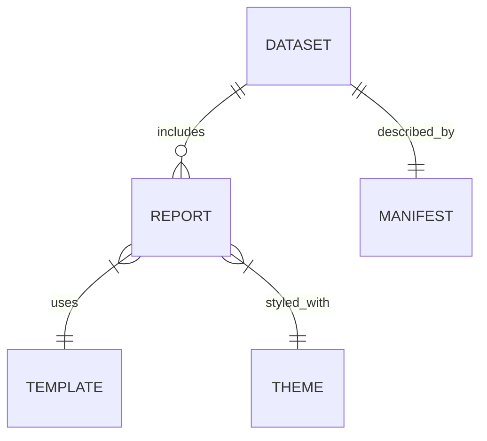

# Data Schema

Pygramattic Reports uses a strict internal schema to ensure consistency across all data sources. All inputs are converted to Pydantic models upon ingestion.

## Core Models

### `Dataset`
The primary unit of data storage.

| Field | Type | Required | Description |
| :--- | :--- | :--- | :--- |
| `id` | `UUID` | Yes | Unique identifier for the dataset. |
| `name` | `str` | Yes | Human-readable name. |
| `created_at` | `datetime` | Yes | Ingestion timestamp. |
| `source` | `str` | Yes | Origin of the data (e.g., "sales.csv"). |
| `schema` | `Dict[str, str]` | Yes | Column names and their data types. |
| `rows` | `List[Dict]` | Yes | The actual data records. |

### `Report`
Represents a generated report configuration.

| Field | Type | Required | Description |
| :--- | :--- | :--- | :--- |
| `title` | `str` | Yes | Report title. |
| `template_id` | `str` | Yes | ID of the template used. |
| `datasets` | `List[UUID]` | Yes | List of Dataset IDs included. |
| `parameters` | `Dict` | No | Custom parameters passed to the template. |

### `Manifest`
Metadata file (`manifest.json`) stored alongside datasets.

| Field | Type | Required | Description |
| :--- | :--- | :--- | :--- |
| `dataset_id` | `UUID` | Yes | Link to the binary/json file. |
| `checksum` | `str` | Yes | SHA-256 hash for integrity verification. |
| `row_count` | `int` | Yes | Total number of records. |
| `columns` | `List[str]` | Yes | List of column headers. |

## Relationships

## Validation

We use Pydantic V2 for high-performance validation.
*   **Strict Types**: Floats are not automatically coerced to strings unless specified.
*   **Constraints**: Positive integers are enforced for counts; non-empty strings for names.
